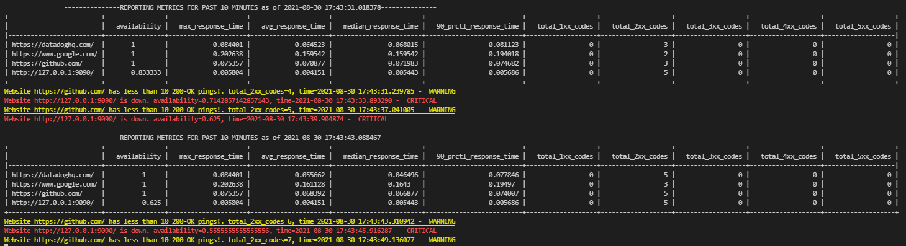

# Website availability & performance monitoring
## Overview

- Create a console program to monitor performance and availability of websites
- The user can define which websites are checked and at what intervals
- Users can keep the console app running and monitor the websites

## Stats
- Check the different websites with their corresponding check intervals
- Compute a few interesting metrics: availability, max/avg response times, response codes count and more...
- Every 10s, display the stats for the past 10 minutes for each website
- Every minute, displays the stats for the past hour for each website

## Alerting
- When a website availability is below 80% for the past 2 minutes, add a message saying that "Website {website } is down. availability={availability }, time={time }"
- When availability resumes for the past 2 minutes, add another message detailing when the alert recovered
- Make sure all messages showing when alerting thresholds are crossed remain visible on the page for historical reasons

## Tests & question
- Write a test for the alerting logic
- Explain how you'd improve on this application design
 


# My Solution

The monitoring application does all of the above, while also allowing the user to specify any type of threshold alert from metrics available that he wishes.
The user can specify the websites being tracked along with their corresponding interval under `websites.txt` and he can also specify any threshold alert he wants under `alerts.txt`. Formats for both are explained on paragraphs below.   

For each website a Website object is created in which attributes such as url, interval, and data is kept. It also provides the method `.start_pingin()` that sets up the scheduling for the pings of the current website based on its interval.

The Metrics abstract class exists, which every metric we wish to keep track of must expand and implement the `.aggregate()` method. This method  implements the logic of how the metric is computed, by basically aggregating over website data for a specified interval. Each metric also keeps track of the website objects in order to have access to the correct data. For metric specific assumptions readh the metrics paragraph.

Each alert the user specifies under `alerts.txt` is mapped to an Alert object that is tracked by the Alerter. Since in our application a time step is when we ping a website, each time a ping happens we also ask the alerter to check all the alerts for this specific website and update the user.
The main use of the Alert object is to keep track of the `metric, website, threshold, severity` combination specified by the user, and check if the metric computed over a specified interval for the website has crossed a threshold (over or under). If so, then an alert is sent based on the severity level. (https://www.datadoghq.com/blog/monitoring-101-alerting/) . The current Alert object is only keeping track for alerts regarding threshold, we can extend the classes to include different types of Alerts (https://www.datadoghq.com/blog/alerting-101-metric-checks/). Colouring of alerts based on severity is specified uner `logging_formatter.py`.

There are more details around design decition and attributes of Alerts class, so `please read the alerts paragraph`.

Finally, we have a helper function under `monitor.py` that prints the statistics requested and reschedules the next print. 

`Testing` is done by spinning up a local server `$python3 run_local_server.py`, closing it after a specified interval and then restaring it again. This way we can check that availablity drops (over the interval the server is closed) and then comes back up while all the alerts are shown correctly.


Event scheduler from Python's Standard Library (`sched`) is used to schedule the pings and the reporing of the metrics correctly.    
Tabluate library (`tabulate`) was used to pretty print the statistics report.    
`Pandas` library was used due to the easy of data organization and methods to compute statistics over intervals (timestamp of pings was used as index).  
`Logging` library was used to simulate alerting severity logic.  
`Black` was used for code formating (not included in requirements.txt)



# Setup

Install required packages (pandas, numpy, requrests, tabulate)
``` bash
$ pip install -r requirements.txt
```

# Run
To run the monitoring service:
``` bash
$ python3 monitor.py -w websites.txt -a alerts.txt
```  
`-w/--websites` is a required argument, format of txt file described below  
`-a/--alerts` is an optional argument, format of .txt file described below

# Testing

All status codes besides 5xx and network errors are considered as successful pings

Correct use of status code counting metrics was tested by pinging `http://httpstat.us/<statud_code_being_checked>`

We can test the alerts by running a local server, shuting it down and restarting it.
``` bash
$ python3 run_local_server.py
```
and then on a different terminal
``` bash
$ python3 monitor.py -w websites.txt -a alerts.txt
```
For simplicity I only keep the server running for 20 seconds and then shut it down for another 40. 
We can see the availability starts of at 1, decreases after server is shutdown and when 0.8 availability threshold is crossed we start alerting on every ping.
When the server is restarted and we recover with availability > 0.8 a final recovery alert is sent on the same severity level.

# Website
Website class in which attributes such as url, interval, and data is kept.
Data is a DataFrame of the history of status_codes and elapsed response times for each ping.
It also provides the method `.start_pingin()` that sets up the scheduling for the pings of the current website based on its interval
### Text file format:
- lines starting with `#` are considered comments and skipped
- each line is a single website holding values: `url, interval`
- make sure that values are comma and single space seperated as above
- no empty lines should exist  

### Example
```
https://datadoghq.com/, 5
https://www.google.com/, 10
https://github.com/, 5
http://127.0.0.1:9090/, 3
```
# Metrics
Each different metric belongs to the Metric abstract class, and it has to be specified under `metrics.py`.   
The `.aggregate()` method of each metric is used to compute an ouput value, by aggregating a websites data over the specified aggregation interval.

All metrics being tracked can be found under `metrics.py` and are also mentioned in the alerts explanation below.

### Assumptions 
- `availability` =  #successful/#total pings over interval where #successful = all status codes besides 5xx and network errors (np.NaN)
- `max_response_time` = max(elapsed) over interval, where elapsed is from response.elapsed (response of GET)
- `avg_response_time` = mean(elapsed) over interval  -//-
- `median_response_time` = median(elapsed) over interval   -//-
- `90_prctl_response_time`= quantile(0.9) of elapsed over interval   -//-
- `total_1xx_codes` = count("1xx" status codes) over interval
- `total_2xx_codes`= count("2xx" status codes) over interval
- `total_3xx_codes`= count("3xx" status codes) over interval
- `total_4xx_codes`= count("4xx" status codes) over interval
- `total_5xx_codes` = count("5xx" status codes) over interval

# Alerts
All alerts need to be specified on a text file (default alerts.txt) and passed as an argument to the `monitor.py` script.


### Text file format:
- lines starting with `#` are considered comments and skipped
- each line is a single alert holding values: `url, severity, metric, aggr_interval, threshold, threshold_type, message_upper, message_lower`
- make sure that values are comma and single space seperated as above
- no empty lines should exist


### Attributes explanation:
- `url`      : url of a website we want to setup the alert for
- `severity` : severity level of an alert
    - possible values = (`1,2,3,4,5`) equivalent to (DEBUG, INFO, WARNING, ERROR, CRITICAL).  
    - The logic behind severity is that not all alerts are equal, and I used different logging levels to represent how we would handle the different alerts as mentioned on : https://www.datadoghq.com/blog/monitoring-101-alerting/
- `metric`   : metric that we want to track
    - possible values = (`availability`, `max_response_time`, `avg_response_time`, `median_response_time`, `90_prctl_response_time`, `total_1xx_codes`, `total_2xx_codes`, `total_3xx_codes`, `total_4xx_codes`, `total_5xx_codes` )
- `aggr_interval`: interval upon which the metric will aggregate saved values and be computed (in seconds)
- `threshold` : threshold which if crossed the alert will be sent (float)
- `threshold_type` : type of the threshold do determine alerting frequency
    - possible values = (`upper`, `lower`)
        - `upper`: As long as metric value > threshold **we keep on printing** `message_upper`.  
        If the metric value was above the threshold and falls below it we print `message_lower` **once**
        - `lower`: vice versa 
- `message_upper` : message printed when metric value > threshold
- `message_lower` : message printed when metric value < threshold

### Examples
1) Setup an alert on https://www.datadoghq.com/ so that when availability drops below 80% for the past 2 minutes, we keep on alerting the user, at severity level 5 (CRITICAL) that "Website https://www.datadoghq.com/ is down. availability={availability}, time={time}". If the availability resumes we alert once that the website recovered

    ```
    # url, severity, metric, aggr_interval, threshold, threshold_type, message_upper, message_lower
    https://datadoghq.com/, 5, availability, 120, 0.8, lower, Website https://datadoghq.com/ has recovered., Website https://datadoghq.com/ is down.
    ```
    *lines starting with #are considered comments and skipped
2) Setup an alert on https://github.com/ so that if the number of `200 OK` responses of the past minute are less 10 we **keep on alerting the user**, at severity level 3 (WARNING) that "Website https://github.com/ has less than 10 successful pings! total_2xx_codes={total_2xx_codes}, time={time}". Vise versa when we have more than 10 successful pings alert the user **once**
    ```
    https://github.com/, 3, total_2xx_codes, 60, 10, lower, Website https://github.com/ has more than 10 200-OK pings!, Website https://github.com/ has less than 10 200-OK pings :(
    ```

# Improvements:
- Add automated tests for the full alerting logic. Currently we are just spinning up a local server and checking if availability prints are correct, but since the application allows for any time of alert to be setup we need to run automated tests.
- Have multiple Alert classes, not just the Threshold Alert one, which I have implemented now. 
    - Change alerts, Outlier alerts, Anomaly alerts, Event alerts Composite alerts, as specified on https://www.datadoghq.com/blog/alerting-101-metric-checks/
- Add persistant storage so that data is saved between runs (InfluxDB could be used since its a timeseries database applicable to our use-case)
- Dynamically resize the reporting output based on terminal size (currently if terminal not wide enough, output might not appear correct if user does not resize)
- Add better extraction logic to message_upper, message_lower from alerts.tx. 
    - For example instead of having "Website github.com is down", we can have "Website $url is down." on the .txt file and with correct parsing (regex.replace()) the alerter can identify the pattern ( something like r"\$.* ") and replace is with the url defined
- Check that urls given are valid
- Provide custom logging level configuration on startup. Currently is set to DEBUG so that all messages regardless of alert severity are printed in the output. 
- Update the printed tabulate table instead of printing it again